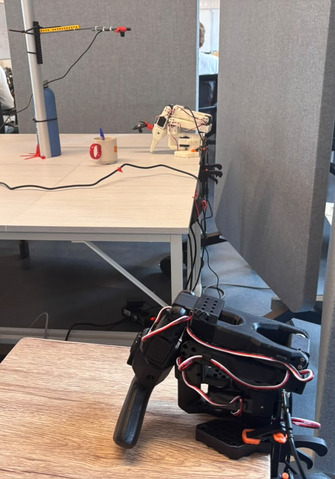
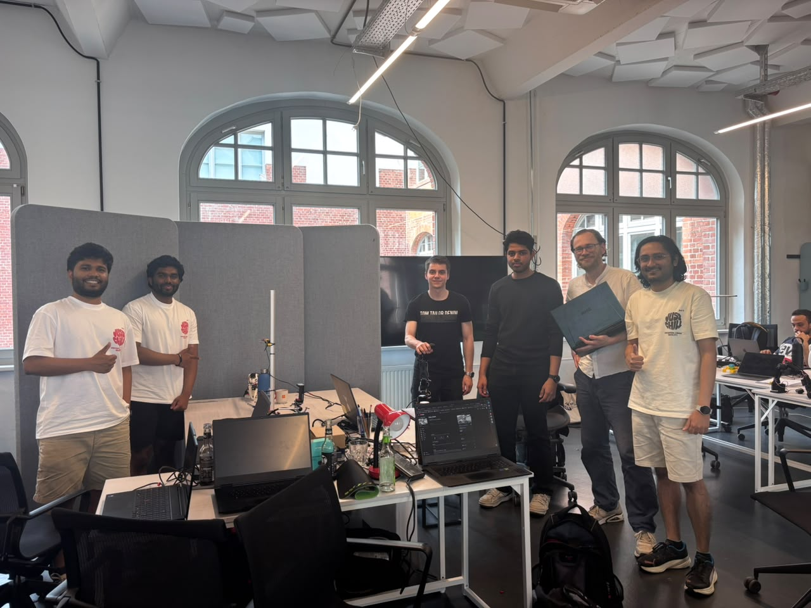

# Desk Hero - Autonomous Pen Organizer

> **Berlin Robotics x AI Hackathon 2025**
> Hugging Face "Desk Hero" Track

A robot arm that autonomously picks up pens from your desk and places them into a cup holder using imitation learning.

[demo Video](https://drive.google.com/file/d/1VMK3gp58UHpjGLzznWbwR9mIphW0xWJV/view?usp=sharing)

[demo youtube](https://youtu.be/SOPR04bkV5k)



---

## The Problem

Pens scattered on your desk are a small but persistent annoyance. We trained a robot arm to solve it: watch the pen go from desk to cup, hands free.

---

## How It Works

We used **imitation learning** via [LeRobot](https://github.com/huggingface/lerobot):

1. **Teleoperation** - A human demonstrated the pick-and-place task ~50 times using a leader arm
2. **Dataset** - Recordings were uploaded to Hugging Face Hub as structured datasets
3. **Training** - An ACT (Action Chunking Transformer) policy was trained on a university GPU cluster (25GB VRAM)
4. **Deployment** - The trained policy runs on the follower arm autonomously in real time

```
Human demos --> Dataset (HF Hub) --> ACT Training --> Autonomous Robot
```

---

## Our Journey

### Camera experiments

We tested two different cameras for the overhead view:

| Camera | Resolution | Result |
|---|---|---|
| Waveshare IMX335 5MP | 2592x1944, 175 FOV | Higher resolution but required more compute for inference. Better suited for setups with powerful GPUs. |
| Logitech C270 HD | 640x480 | Lower resolution but produced the best inference results with ACT policy on our laptop GPU. Faster frame processing meant smoother robot control. |

**Lesson learned:** Higher resolution does not always mean better performance. The Logitech C270 at 640x480 gave us the most reliable pick-and-place behavior because the inference loop ran faster and the robot responded more smoothly.

### Policy experiments

We tried two different approaches:

**SmolVLA (Vision-Language-Action model)**
We started with SmolVLA because it accepts natural language instructions like "Pick up the pen and place it in the cup". Zero-shot inference showed the model had some spatial understanding (it moved toward the pen area) but the grasping precision was not reliable enough. SmolVLA with 450M parameters was too heavy for real-time inference on our laptop GPU (RTX 500 Ada, 4GB mobile) running at only 2-3 Hz.

**ACT (Action Chunking Transformer)**
We switched to ACT which trains from scratch on demonstration data only. It is much lighter (52M parameters), trains 3x faster, and runs at near real-time speeds. With 50 demonstration episodes, ACT reliably learned the full pick-and-place motion. This became our primary policy.

### Training progression

We trained multiple checkpoints with increasing steps:

| Checkpoint | Steps | Performance |
|---|---|---|
| `lorenz-k/desk-hero31-20k` | 20,000 | Reaches toward pen, sometimes grasps |
| `lorenz-k/desk-hero31-50k` | 50,000 | Reliable pick and place, our best model |

### Dataset evolution

We recorded data in three sessions as we improved our technique:

| Dataset | Episodes | Notes |
|---|---|---|
| `lorenz-k/desk-hero111` | 25 | Improved consistency |
| `lorenz-k/desk-hero112` | 25 | Best Quality Dataset |
| `jan024/desk-hero-merged-new` | 50 | All three merged for final training |

---

## Hardware

| Component | Details |
|---|---|
| Robot Arms | 2x SO-101 (leader for teleoperation, follower for execution) |
| Camera (wrist) | Waveshare IMX335 5MP USB Camera, 2K, 175 wide angle |
| Camera (overhead) | Logitech C270 HD Webcam |
| Compute (training) | H-BRS University cluster, 25GB VRAM |
| Compute (inference) | ThinkPad with NVIDIA RTX 500 Ada Mobile GPU |
| OS | Ubuntu 22.04 |

---

## Datasets & Models

| Resource | Link |
|---|---|
| Dataset (merged, 50 episodes) | [jan024/desk-hero-merged-new](https://huggingface.co/datasets/jan024/desk-hero-merged-new) |
| ACT Policy (50k steps, best) | [lorenz-k/desk-hero31-50k](https://huggingface.co/lorenz-k/desk-hero31-50k) |
| ACT Policy (20k steps) | [lorenz-k/desk-hero31-20k](https://huggingface.co/lorenz-k/desk-hero31-20k) |
| ACT Policy (10k steps) | [amrit97/pen_to_holder_final_act](https://huggingface.co/amrit97/pen_to_holder_final_act) |
| SmolVLA Policy (experimental) | [jan024/pen_to_holder_final](https://huggingface.co/jan024/pen_to_holder_final) |

---

## Setup & Installation

### Prerequisites

- Ubuntu 22.04
- Python 3.12
- NVIDIA GPU with CUDA
- SO-101 robot arm(s)

### Install

```bash
# Clone this repo
git clone https://github.com/Jannen06/desk-hero.git
cd desk-hero

# Install uv
curl -LsSf https://astral.sh/uv/install.sh | sh
export PATH="$HOME/.local/bin:$PATH"

# Clone and install LeRobot
git clone https://github.com/Jannen06/lerobot.git
cd lerobot
uv venv --python 3.12
source .venv/bin/activate
uv pip install -e ".[pusht,viz,smolvla]"
uv pip install -r ../requirements.txt

# Login to HuggingFace
hf auth login

# Robot serial port permissions
sudo usermod -a -G dialout $USER
sudo chmod 666 /dev/ttyACM0
```

### Important: Clear ROS environment if installed

```bash
unset PYTHONPATH
unset AMENT_PREFIX_PATH
```

---

## Running the Demo

### 1. Find your camera and robot ports

```bash
lerobot-find-cameras
lerobot-find-port
ls /dev/ttyACM*
```

### 2. Run pick-and-place with the loop script

Edit `pick_loop.sh` to set your camera indices and robot port, then:

```bash
chmod +x pick_loop.sh
./pick_loop.sh
```

You can switch between policies by editing the `POLICY_PATH` variable in the script:
- `lorenz-k/desk-hero31-50k` - best results (50k training steps)
- `lorenz-k/desk-hero31-20k` - faster loading (20k training steps)

### 3. Single rollout command

```bash
lerobot-record \
  --robot.type=so101_follower \
  --robot.port=/dev/ttyACM0 \
  --robot.id=follower_arm \
  --robot.cameras='{"wrist": {"type": "opencv", "index_or_path": 4, "width": 640, "height": 480, "fps": 30, "fourcc": "MJPG"}, "overhead": {"type": "opencv", "index_or_path": 2, "width": 640, "height": 480, "fps": 30, "fourcc": "MJPG"}}' \
  --policy.path=lorenz-k/desk-hero31-50k \
  --dataset.repo_id=lorenz-k/eval_desk-hero-merged4 \
  --dataset.single_task="Pick and place the pen in the cup" \
  --dataset.num_episodes=3 \
  --dataset.episode_time_s=30 \
  --dataset.push_to_hub=false
```

---

## Training (reproduce from scratch)

### Record demonstrations

```bash
lerobot-record \
  --robot.type=so101_follower \
  --robot.port=/dev/ttyACM0 \
  --teleop.type=so101_leader \
  --teleop.port=/dev/ttyACM1 \
  --dataset.repo_id=YOUR_HF_USERNAME/desk-hero \
  --dataset.single_task="Pick and place the pen in the cup" \
  --dataset.num_episodes=50 \
  --dataset.episode_time_s=15 \
  --robot.cameras='{"overhead": {"type": "opencv", "index_or_path": 2, "width": 640, "height": 480, "fps": 30, "fourcc": "MJPG"}, "wrist": {"type": "opencv", "index_or_path": 4, "width": 640, "height": 480, "fps": 30, "fourcc": "MJPG"}}'
```

### Merge multiple datasets

```bash
lerobot-edit-dataset \
  --operation.type merge \
  --operation.repo_ids '["lorenz-k/desk-hero24", "lorenz-k/desk-hero25", "lorenz-k/desk-hero29"]' \
  --new_repo_id lorenz-k/desk-hero-merged
```

### Train ACT policy

```bash
lerobot-train \
  --policy.type act \
  --dataset.repo_id lorenz-k/desk-hero-merged \
  --policy.repo_id YOUR_HF_USERNAME/desk-hero-act \
  --output_dir outputs/train/desk_hero_act \
  --rename_map '{"observation.images.overhead": "observation.images.overhead", "observation.images.wrist": "observation.images.wrist"}' \
  --policy.input_features '{"observation.images.overhead": {"type": "VISUAL", "shape": [3, 480, 640]}, "observation.images.wrist": {"type": "VISUAL", "shape": [3, 480, 640]}, "observation.state": {"type": "STATE", "shape": [6]}}' \
  --policy.output_features '{"action": {"type": "ACTION", "shape": [6]}}' \
  --batch_size 32 \
  --steps 50000
```

---

## Team

**Hugging Face Hackathon Berlin 2025 - Team 1**



| # | Name | GitHub | Background | Role |
|---|---|---|---|---|
| 1 | Lorenz Krapp | [@lorenz-k](https://github.com/lorenz-k) | Computer Science | Calibration, training, inference |
| 2 | Amritanshu Amrit | [@amrit9782](https://github.com/amrit9782) | Robotics | Training policies on GPU cluster, inference testing, video demo |
| 3 | Nikhil Ravi | [@Nikhil-URG](https://github.com/Nikhil-URG) | Robotics | Hardware setup, calibration, recording training data |
| 4 | Jannen Thyriar | [@Jannen06](https://github.com/Jannen06) | Robotics | Ideas, training pipeline, rollout inference pipeline, documentation |
| 5 | Abhilash BK | [@Abhi-codr](https://github.com/Abhi-codr) | - | Recording training data, ideas |
| 6 | Michael Schafer | [@mischa-robots](https://github.com/mischa-robots) | AI / ML | Hardware setup, camera calibration |

**University:** Hochschule Bonn-Rhein-Sieg (H-BRS)

---

## Acknowledgements

- [Hugging Face LeRobot](https://github.com/huggingface/lerobot) - robot learning framework
- [H-BRS GPU Cluster](https://www.h-brs.de) - compute for training
- Berlin Robotics x AI Hackathon organizers